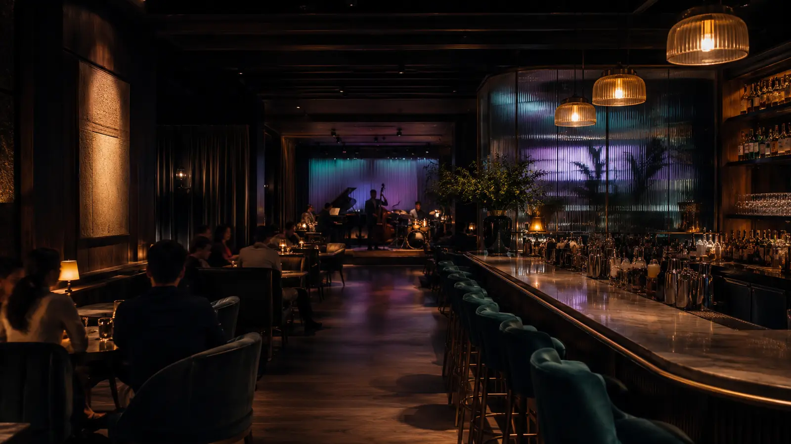

# Aurora Bar



A premium one-page restaurant and live-music bar experience built as a portfolio project. Aurora Bar combines a cinematic hospitality aesthetic with a lightweight interactive 3D environment, cursor-responsive motion, scroll reveals, original food photography, and a complete responsive reservation journey.

## Live website

[aurora-bar.khen-guinez.chatgpt.site](https://aurora-bar.khen-guinez.chatgpt.site)

## Highlights

- Interactive React Three Fiber environment with a custom GLSL aurora shader
- Cursor-driven tilt, ambient ripple, parallax, and cinematic scroll reveals
- Graceful WebGL and reduced-motion fallbacks
- Original fictional brand identity and optimized venue, food, and live-band imagery
- Sticky navigation, opening loader, signature menu, evening timeline, gallery, testimonials, location, and reservation flow
- Fully responsive layouts for desktop, tablet, and mobile
- Accessible form labels, semantic landmarks, keyboard-friendly controls, and meaningful image descriptions
- Lazy-loaded 3D scene with capped pixel density and compressed WebP assets

## Technology

- React 19
- Next.js 16 / Vinext
- TypeScript
- Tailwind CSS 4
- React Three Fiber and Drei
- Framer Motion
- Three.js and custom GLSL shaders
- Lucide icons

## Run locally

Requirements: Node.js 22.13 or newer.

```bash
npm install
npm run dev
```

Open the local address shown in your terminal.

## Useful commands

```bash
npm run dev       # Start development mode
npm run lint      # Run the code-quality checks
npm run build     # Create the production build
npm test          # Build and run the rendered HTML test
```

## Project structure

```text
app/                         Page, metadata, and global visual system
components/AuroraExperience Main one-page experience and interactions
components/AuroraScene      Lazy-loaded 3D scene and GLSL shaders
public/images/               Optimized original website imagery
worker/                      Hosting entry point
```

## Portfolio notice

Aurora Bar, its address, menu, testimonials, and reservation experience are fictional. The reservation form is deliberately a front-end demonstration: it does not transmit or store personal information.

## License

This project is available under the [MIT License](LICENSE).
